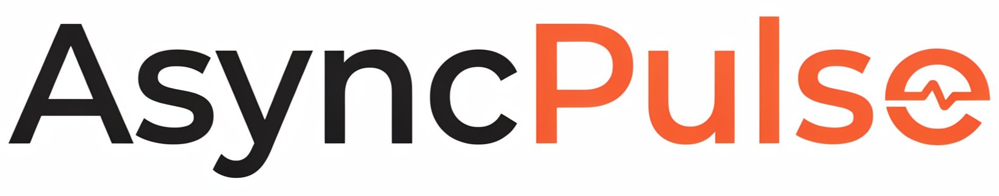
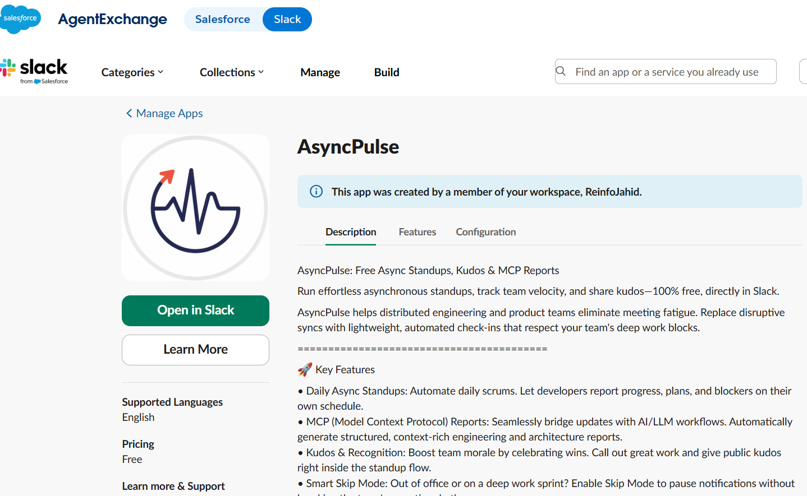

# AsyncPulse

**Free Async Standups, Kudos & MCP Reports**

Run effortless asynchronous standups, track team velocity, share kudos, and weekly summaries directly in Slack.

AsyncPulse helps distributed engineering and product teams eliminate meeting fatigue. Replace disruptive syncs with lightweight, automated check-ins that respect your team's deep work blocks.

---

## ✨ Key Features

- **Daily Async Standups**  
  Automate daily scrums. Let developers report progress, plans, and blockers on their own schedule.

- **MCP (Model Context Protocol) Reports**  
  Seamlessly bridge updates with AI/LLM workflows. Automatically generate structured, context-rich engineering and architecture reports.

- **Kudos & Recognition**  
  Boost team morale by celebrating wins. Call out great work and give public kudos right inside the standup flow.

- **Smart Skip Mode**  
  Out of office or on a deep work sprint? Enable Skip Mode to pause notifications without breaking the team's reporting rhythm.

- **Analytics & Insights**  
  Monitor participation trends, track blocker frequency, and spot workflow bottlenecks early.

- **CSV Data Export**  
  Own your data. Export your standup history, analytics, and metrics to CSV with a single click.

---

## 🚀 Get Started in 60 Seconds

1. Add AsyncPulse to your Slack workspace.
2. Customize your standup questions and schedule.
3. Let your team work in peace while AsyncPulse keeps everyone in sync.

---

## 📦 Installation

Click the link below to add AsyncPulse to your Slack workspace:

👉 **[Install AsyncPulse on Slack](https://reinfojahid.slack.com/marketplace/A0B99PRQAP5-asyncpulse)**

---

## 📊 Why AsyncPulse?

| Feature | Benefit |
|---------|---------|
| Async Standups | No more meeting interruptions |
| AI-Ready Reports | Feed context directly into LLM workflows |
| Team Recognition | Build a positive culture effortlessly |
| Smart Scheduling | Adapts to time zones and work patterns |
| Data Ownership | Full export capabilities |

---

## 📖 I Wrote a Book on AI Product Management

*The AI Product Brief* – how sharp PMs think, work, and lead when building products that can surprise you. Feel free to read it:

👉 **[Read the Book](https://ai-product-brief.netlify.app/)**

---

## 📫 Support

Have questions? Reach out to us through open an issue in this repository.

---

*Made with ❤️ for distributed teams everywhere.*
